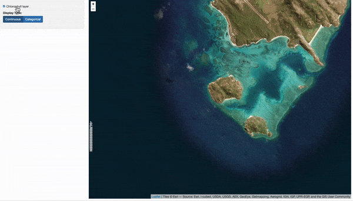
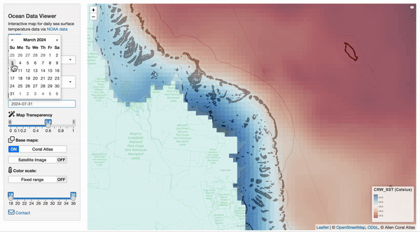

```{r setup, include=FALSE}
knitr::opts_chunk$set(echo = TRUE)
```

#### a collection of R and javascript tools for interactive mapping, ecology, and conservation

##### [george.roff\@csiro.au](mailto:george.roff@csiro.au){.email} (05/08/2024)

<br>

Collection of spatial tools developed in `r`, `leaflet` and `shiny` that build upon `leaflet draw` functionality implemented in `leafem` and `leaflet.extras` that facilitate spatial planning and data visualisation. Note: these tools are **functional** examples for development and should be adapted if used (i.e. coded in a more efficient way).

<br>

## Simple spatial tools

<hr>

### a) rotate polygons

{width="900"}

Adds rotate functionality to `leaflet` by implementing the javascript leaflet plugin `Leaflet.draw.rotate` from <https://github.com/onaci/Leaflet.draw.rotate> in the [`leaflet_extras`](https://github.com/trafficonese/leaflet.extras) plugin [`Leaflet.Draw`](http://leaflet.github.io/Leaflet.draw/docs/leaflet-draw-latest.html) by using a custom version of the [`Leaflet.Path.Transform`](https://github.com/w8r/Leaflet.Path.Transform) plugin. Useful for defining selecting non-gridded raster values for dynamic classification (see "Spatial decision tools" below for implementation).

-   Link to [code](https://github.com/marine-ecologist/spatialtools/blob/main/r/rotate-polygons_0.1.R)
-   Link to [shiny example](https://marine-ecologist.shinyapps.io/rotate-polygons/) </br> </br>

<hr>

### b) draw plots

{width="900"}

Creating fixed grid size plots (e.g. 100m x 100m, 1ha) within leaflet currently yet to be implemented. Note: `leaflet` uses `EPSG:4326` coordinate reference system, so dimensions are approximate **°**0.00045 degrees lat/lon coordinates.

-   Link to [code](https://github.com/marine-ecologist/spatialtools/blob/main/r/draw-plots_0.1.R)
-   Link to [shiny example](https://marine-ecologist.shinyapps.io/draw-plots/)

</br> </br>

## Dynamic raster classification

</br>

<hr>

### a) static rasters

{width="900"}

D ynamic classification of static rasters by interactive reclassification of **n** bins and range for each interval. Adjusting the end point of the slider will dynamically shift the start point of the next bin. Example code below uses simulated raster data in `R` via `gstat` to approximate clustered raster cells.

-   Link to [code](https://github.com/marine-ecologist/spatialtools/blob/main/r/classify-rasters_0.1.R)
-   Link to [shiny example](https://marine-ecologist.shinyapps.io/classify-rasters/) </br> </br>

<hr>

### b) dynamic rasters

{width="900"}

Allows dynamic classification of rasters as above, but uses dynamic subsetting of spatial data from the current map extent. The code extracts satellite data (e.g. SST, Chl a) from the [NOAA ERDAPP](https://www.ncei.noaa.gov/erddap/info/index.html?page=1&itemsPerPage=1000) servers for the extent of the current map area (see below Interactive raster data visualisation for explanation), and then implements interactive reclassification of *n* bins and range for each interval. Note - the approach is similar to importing geoserver WMS tiles for a given map extent except uses raw data in `.csv` format to create raster files when zoom/recenter or changing classification from ordinal/continuous data.

Example uses Multiscale Ultrahigh Resolution (MUR) sea surface temperature (SST) from [coastwatch](https://eastcoast.coastwatch.noaa.gov/cw_podaac-mur_sst.php) at 0.01° resolution with a 7-day lag from present date.

-   Link to [code](https://github.com/marine-ecologist/spatialtools/blob/main/r/classify-rasters-wms_0.1.R)
-   Link to [shiny example](https://marine-ecologist.shinyapps.io/classify-rasters-wms/)

</br> </br>

<hr>

## Interactive spatial tools

</br>

### i) Visualise raster time-series

{width="900"}

Interactive visualisation of historical daily raster data from the NOAA ERDAPP servers.

Features:

-   Select satellite data sources from from ERDAPP servers

-   Specify dates for data

-   Use WMS base maps (coral atlas, ESRI imagery)

-   Allow custom palettes (e.g. NOAA degree heating weeks)

Example includes Great Barrier Reef and Ningloo (Western Australia) and data sourced from NOAA CRW and MUR. Note: currently uses re-rendering of raster images via `.csv` rather than direct conversion of .nc files, which is potentially inefficient - revisit with `stars::read_stars` over `terra::rast` at later stage

-   Link to [code](https://github.com/marine-ecologist/spatialtools/blob/main/r/time-series_0.1.R)
-   Link to [shiny example](https://marine-ecologist.shinyapps.io/Interactive-Ocean-Data/)

</br> </br>

<hr>

### ii) Exclude map zones


Leaflet implementation of dynamic cropping of vector and raster layers to exclude zones from existing datasets prior to site selection. Users / stakeholders can draw zones/areas on the map, which are used to inversely mask the raster layer, updating the baselayers to exclude from further analysis. Code includes vector Allen coral atlas data and an aggregated raster layer generated by a Gaussian random field simulation.

-   Link to [code](https://github.com/marine-ecologist/spatialtools/blob/main/r/remove-zones_0.1.R)
-   Link to [shiny example](https://marine-ecologist.shinyapps.io/spatial-decision-tool/)

</br> </br>

<hr>

### iii) Dynamic spatial selection


Dynamic site selection tool for allowing users to interactively explore and analyze spatial layers through a `leaflet` map interface. Example includes simulated raster data of varying gridcell sizes (Temperature, Sedimentation, DHW, Wave Exposure, Chlorophyll, Salinity) and a "restoration score" (basic additive algorithm for categorical raster layers). Underlying code categorises each raster datalayer into ordinal values (see classify rasters) and calculates an unweighted mean, but can be implemented with any algorithm.

-   Link to [code](https://github.com/marine-ecologist/spatialtools/blob/main/r/dynamic-spatial-selection_0.1.R)
-   Link to [shiny example](https://marine-ecologist.shinyapps.io/spatial-decision-tool/)
